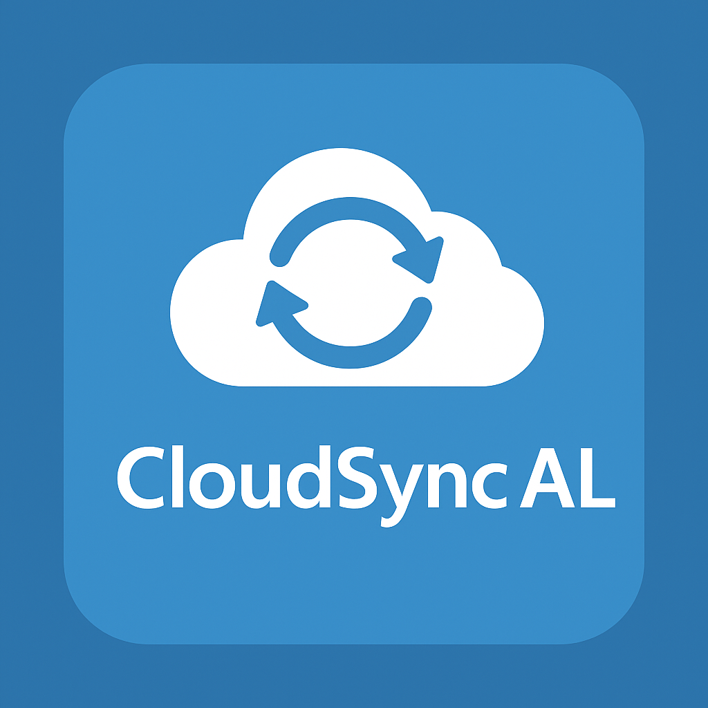

# CloudSync AL for Visual Studio Code

---

## ✨ Features

- Detects the active **`app.json`** in your workspace.
- Prompts you to **select an environment** if multiple AL launch configs are present.
- Fetches installed version from **Business Central Online**, bumps **minor**.
- Compiles `.app` using the **AL Language** compiler.
- Publishes via **BcContainerHelper** (upload → sync → install).
- Cleans up **older versions** automatically.
- Beautiful terminal UX with spinners, ✔ / ✗, and summary card.

---

## 🚀 Easy Installation

1. Open the **Extensions** sidebar in Visual Studio Code.
2. Search for **CloudSync AL**.
3. Click **Install** to install it.
4. Press **F1** → run **CloudSync AL: Deploy PTE**.
5. Watch deployment logs in the **CloudSync AL** terminal.
6. 🌟 Enjoy and [rate five-stars](https://marketplace.visualstudio.com/items?itemName=lekaledian.cloudsync-al&ssr=false#review-details).

---

## ⚙️ Requirements

- [AL Language Extension](https://marketplace.visualstudio.com/items?itemName=ms-dynamics-smb.al)
- PowerShell 7+ (`pwsh`)
- [BcContainerHelper](https://www.powershellgallery.com/packages/BcContainerHelper)

---

## 📄 License

[MIT](https://github.com/Ledian63S/cloudsync-al/blob/main/LICENSE)

---

## 👨‍💻 Author

**Ledian Leka**  
🌐 [ledian63s.github.io](https://ledian63s.github.io)  
🐙 [GitHub @Ledian63S](https://github.com/Ledian63S)
